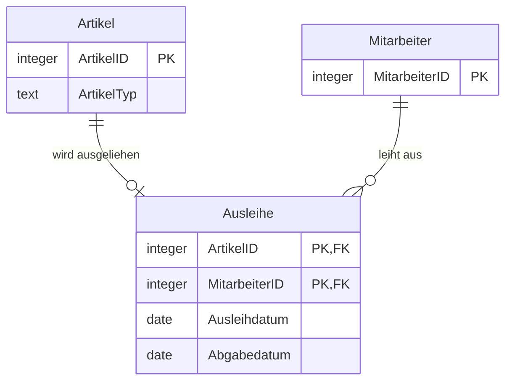

# Dokumentation der Datenbank: Ausleihverwaltung

## 1. Zweck der Datenbank

Die Datenbank verwaltet die Ausleihe von Artikeln (z. B. Geräte oder Arbeitsmittel) an Mitarbeiter. Sie hält fest, **welcher Mitarbeiter welchen Artikel wann ausgeliehen** und **wann er ihn zurückgegeben hat**. Damit lässt sich jederzeit nachvollziehen, welche Artikel aktuell verliehen sind und wer sie hat.

## 2. Tabellen und Spalten

### Tabelle `Artikel`
Enthält alle ausleihbaren Gegenstände.

| Spalte      | Datentyp | Eigenschaften                          | Beschreibung                                  |
|-------------|----------|----------------------------------------|-----------------------------------------------|
| `ArtikelID` | integer  | Primärschlüssel, auto-increment, unique, not null | Eindeutige Kennung des Artikels |
| `ArtikelTyp`| text     | not null                               | Art/Kategorie des Artikels (z. B. Laptop)     |

### Tabelle `Mitarbeiter`
Enthält alle Personen, die Artikel ausleihen dürfen.

| Spalte          | Datentyp | Eigenschaften                          | Beschreibung                          |
|-----------------|----------|----------------------------------------|---------------------------------------|
| `MitarbeiterID` | integer  | Primärschlüssel, auto-increment, unique, not null | Eindeutige Kennung des Mitarbeiters |

### Tabelle `Ausleihe`
Verknüpfungstabelle, die Artikel und Mitarbeiter über einen Ausleihvorgang verbindet.

| Spalte          | Datentyp | Eigenschaften                          | Beschreibung                                           |
|-----------------|----------|----------------------------------------|--------------------------------------------------------|
| `ArtikelID`     | integer  | Teil des Primärschlüssels, Fremdschlüssel, not null | Verweis auf den ausgeliehenen Artikel   |
| `MitarbeiterID` | integer  | Teil des Primärschlüssels, Fremdschlüssel, not null | Verweis auf den ausleihenden Mitarbeiter |
| `Ausleihdatum`  | date     | not null                               | Datum, an dem der Artikel ausgeliehen wurde            |
| `Abgabedatum`   | date     | optional (NULL erlaubt)                | Datum der Rückgabe; NULL = noch nicht zurückgegeben    |

## 3. ERD (Entity-Relationship-Diagramm)

**Beziehungen:**

- `Artikel` – `Ausleihe`: 1 : 0..1 (laut Definition `-`, also eine Eins-zu-eins-Beziehung)
- `Mitarbeiter` – `Ausleihe`: 1 : n (ein Mitarbeiter kann mehrere Ausleihen haben)

## 4. Datenregeln

### Schlüssel und Eindeutigkeit
- `Artikel.ArtikelID` und `Mitarbeiter.MitarbeiterID` sind eindeutig und werden automatisch hochgezählt.
- Der Primärschlüssel von `Ausleihe` ist zusammengesetzt aus `ArtikelID` und `MitarbeiterID`. Dieselbe Kombination aus Artikel und Mitarbeiter kann daher nur **einmal** vorkommen.

### Pflichtfelder
- `ArtikelTyp`, `Ausleihdatum` sowie beide Fremdschlüssel in `Ausleihe` müssen immer befüllt sein.
- `Abgabedatum` ist optional. Solange es leer ist, gilt der Artikel als ausgeliehen.

### Referenzielle Integrität
- Jeder Eintrag in `Ausleihe` muss auf einen existierenden Artikel und einen existierenden Mitarbeiter verweisen.
- Bei beiden Fremdschlüsseln gilt `delete: no action` und `update: no action`. Ein Artikel oder Mitarbeiter, zu dem noch Ausleihen existieren, kann **nicht gelöscht** und seine ID **nicht geändert** werden.

### Hinweise zur Modellierung
- Da die Beziehung `Artikel` – `Ausleihe` als 1 : 1 definiert ist, kann jeder Artikel nur in **einer** Ausleihe vorkommen. Eine wiederholte Ausleihe desselben Artikels (Ausleihhistorie) ist so nicht möglich. Für eine Historie sollte die Beziehung 1 : n sein (`<`) und der Primärschlüssel z. B. um das `Ausleihdatum` oder eine eigene `AusleiheID` erweitert werden.
- Nicht durch die Datenbank abgesichert, aber sinnvoll: `Abgabedatum` sollte nicht vor `Ausleihdatum` liegen (z. B. per CHECK-Constraint).
- `Mitarbeiter` enthält bisher nur die ID. Für den praktischen Einsatz wären Spalten wie Name oder Abteilung sinnvoll.